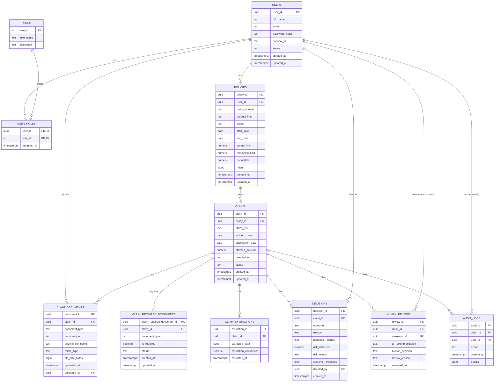

# AXA Egypt AI-Powered Claims Processing Platform — Database Schema Specification

This document is the complete PostgreSQL schema specification, built strictly from the agreed table list. It adds no tables, removes none, and keeps `policies.riders` and `decisions.handbook_clause` exactly as specified (no `policy_riders` table, no handbook/RAG/vector tables in PostgreSQL).

---

## 1. ERD (Mermaid)



**PostgreSQL vs. RAG / Knowledge Store**
- PostgreSQL holds all 11 operational tables above.
- The **Policy Handbook** and any embeddings/vector index live entirely in the RAG / Knowledge Store, outside PostgreSQL.
- `decisions.handbook_clause` is a plain text **reference** (e.g. a clause ID/citation) into that external store — never the handbook content itself.
- No `handbook`, `policy_riders`, or vector/embedding table exists in this schema, per the constraint.

---

## 2. Full DDL

```sql
-- ============================================================
-- EXTENSIONS
-- ============================================================
CREATE EXTENSION IF NOT EXISTS "pgcrypto"; -- for gen_random_uuid()

-- ============================================================
-- 1. users
-- ============================================================
CREATE TABLE users (
    user_id        UUID PRIMARY KEY DEFAULT gen_random_uuid(),
    full_name      TEXT NOT NULL,
    email          TEXT NOT NULL,
    password_hash  TEXT NOT NULL,
    national_id    TEXT,
    status         TEXT NOT NULL DEFAULT 'ACTIVE'
                   CHECK (status IN ('ACTIVE', 'SUSPENDED', 'DISABLED')),
    created_at     TIMESTAMPTZ NOT NULL DEFAULT now(),
    updated_at     TIMESTAMPTZ NOT NULL DEFAULT now(),
    CONSTRAINT uq_users_email UNIQUE (email),
    CONSTRAINT uq_users_national_id UNIQUE (national_id)
);

-- ============================================================
-- 2. roles
-- ============================================================
CREATE TABLE roles (
    role_id      SERIAL PRIMARY KEY,
    role_name    TEXT NOT NULL,
    description  TEXT,
    CONSTRAINT uq_roles_role_name UNIQUE (role_name),
    CONSTRAINT chk_roles_role_name CHECK (role_name IN ('Customer', 'Assessor', 'Operations'))
);

-- ============================================================
-- 3. user_roles (N:M)
-- ============================================================
CREATE TABLE user_roles (
    user_id      UUID NOT NULL REFERENCES users(user_id) ON DELETE CASCADE,
    role_id      INT  NOT NULL REFERENCES roles(role_id) ON DELETE RESTRICT,
    assigned_at  TIMESTAMPTZ NOT NULL DEFAULT now(),
    PRIMARY KEY (user_id, role_id)
);

-- ============================================================
-- 4. policies
-- ============================================================
CREATE TABLE policies (
    policy_id        UUID PRIMARY KEY DEFAULT gen_random_uuid(),
    user_id          UUID NOT NULL REFERENCES users(user_id) ON DELETE RESTRICT,
    policy_number    TEXT NOT NULL,
    product_line     TEXT NOT NULL
                     CHECK (product_line IN ('HEALTH', 'MOTOR', 'PROPERTY', 'TRAVEL')),
    status           TEXT NOT NULL DEFAULT 'PENDING'
                     CHECK (status IN ('ACTIVE', 'LAPSED', 'CANCELLED', 'PENDING')),
    start_date       DATE NOT NULL,
    end_date         DATE NOT NULL,
    annual_limit     NUMERIC(14,2) NOT NULL CHECK (annual_limit >= 0),
    remaining_limit  NUMERIC(14,2) NOT NULL CHECK (remaining_limit >= 0),
    deductible       NUMERIC(14,2) NOT NULL DEFAULT 0 CHECK (deductible >= 0),
    riders           JSONB NOT NULL DEFAULT '[]'::jsonb,  -- e.g. ["OUTPATIENT","MATERNITY"]
    created_at       TIMESTAMPTZ NOT NULL DEFAULT now(),
    updated_at       TIMESTAMPTZ NOT NULL DEFAULT now(),
    CONSTRAINT uq_policies_policy_number UNIQUE (policy_number),
    CONSTRAINT chk_policies_dates CHECK (end_date >= start_date),
    CONSTRAINT chk_policies_remaining_limit CHECK (remaining_limit <= annual_limit)
);

CREATE INDEX idx_policies_user_id ON policies(user_id);

-- ============================================================
-- 5. claims
-- ============================================================
CREATE TABLE claims (
    claim_id         UUID PRIMARY KEY DEFAULT gen_random_uuid(),
    policy_id        UUID NOT NULL REFERENCES policies(policy_id) ON DELETE RESTRICT,
    claim_type       TEXT NOT NULL,
    incident_date    DATE NOT NULL,
    submission_date  DATE NOT NULL DEFAULT CURRENT_DATE,
    claimed_amount   NUMERIC(14,2) NOT NULL CHECK (claimed_amount >= 0),
    description      TEXT,
    status           TEXT NOT NULL DEFAULT 'PROCESSING'
                     CHECK (status IN (
                        'PROCESSING', 'WAITING_FOR_DOCUMENTS', 'UNDER_HUMAN_REVIEW',
                        'APPROVED', 'REJECTED', 'ROUTED', 'ESCALATED',
                        'BELOW_DEDUCTIBLE', 'CLOSED'
                     )),
    created_at       TIMESTAMPTZ NOT NULL DEFAULT now(),
    updated_at       TIMESTAMPTZ NOT NULL DEFAULT now(),
    CONSTRAINT chk_claims_incident_before_submission CHECK (incident_date <= submission_date)
);

CREATE INDEX idx_claims_policy_id ON claims(policy_id);
CREATE INDEX idx_claims_status ON claims(status);

-- ============================================================
-- 6. claim_documents
-- ============================================================
CREATE TABLE claim_documents (
    document_id          UUID PRIMARY KEY DEFAULT gen_random_uuid(),
    claim_id             UUID NOT NULL REFERENCES claims(claim_id) ON DELETE CASCADE,
    document_type        TEXT NOT NULL,
    document_url         TEXT NOT NULL,        -- reference into Object Storage
    original_file_name   TEXT NOT NULL,
    mime_type             TEXT NOT NULL,
    file_size_bytes       BIGINT NOT NULL CHECK (file_size_bytes >= 0),
    uploaded_at           TIMESTAMPTZ NOT NULL DEFAULT now(),
    uploaded_by           UUID REFERENCES users(user_id) ON DELETE SET NULL
);

CREATE INDEX idx_claim_documents_claim_id ON claim_documents(claim_id);

-- ============================================================
-- 7. claim_required_documents
-- ============================================================
CREATE TABLE claim_required_documents (
    claim_required_document_id  UUID PRIMARY KEY DEFAULT gen_random_uuid(),
    claim_id                    UUID NOT NULL REFERENCES claims(claim_id) ON DELETE CASCADE,
    document_type               TEXT NOT NULL,
    is_required                 BOOLEAN NOT NULL DEFAULT TRUE,
    status                      TEXT NOT NULL DEFAULT 'MISSING'
                                CHECK (status IN ('MISSING', 'UPLOADED', 'VERIFIED')),
    created_at                  TIMESTAMPTZ NOT NULL DEFAULT now(),
    updated_at                  TIMESTAMPTZ NOT NULL DEFAULT now(),
    CONSTRAINT uq_claim_required_documents UNIQUE (claim_id, document_type)
);

CREATE INDEX idx_claim_required_documents_claim_id ON claim_required_documents(claim_id);

-- ============================================================
-- 8. claim_extractions
-- ============================================================
CREATE TABLE claim_extractions (
    extraction_id          UUID PRIMARY KEY DEFAULT gen_random_uuid(),
    claim_id               UUID NOT NULL REFERENCES claims(claim_id) ON DELETE CASCADE,
    extracted_data          JSONB NOT NULL,   -- shape varies by product line (Health/Motor/Property/Travel)
    extraction_confidence   NUMERIC(5,4) CHECK (extraction_confidence BETWEEN 0 AND 1),
    extracted_at             TIMESTAMPTZ NOT NULL DEFAULT now()
);

CREATE INDEX idx_claim_extractions_claim_id ON claim_extractions(claim_id);

-- ============================================================
-- 9. decisions
-- ============================================================
CREATE TABLE decisions (
    decision_id        UUID PRIMARY KEY DEFAULT gen_random_uuid(),
    claim_id           UUID NOT NULL REFERENCES claims(claim_id) ON DELETE CASCADE,
    outcome            TEXT NOT NULL
                       CHECK (outcome IN ('AUTO_APPROVE', 'REJECT', 'ROUTE_TO_HUMAN', 'ESCALATE')),
    reason             TEXT,
    handbook_clause    TEXT,   -- reference only; handbook content lives in the RAG store
    risk_detected      BOOLEAN NOT NULL DEFAULT FALSE,
    risk_reason        TEXT,
    customer_message   TEXT,   -- drafted & displayed only, never sent by email/SMS
    decided_by         UUID REFERENCES users(user_id) ON DELETE SET NULL,  -- NULL = system-decided
    created_at         TIMESTAMPTZ NOT NULL DEFAULT now()
);

CREATE INDEX idx_decisions_claim_id ON decisions(claim_id);

-- ============================================================
-- 10. human_reviews
-- ============================================================
CREATE TABLE human_reviews (
    review_id           UUID PRIMARY KEY DEFAULT gen_random_uuid(),
    claim_id            UUID NOT NULL REFERENCES claims(claim_id) ON DELETE CASCADE,
    assessor_id         UUID NOT NULL REFERENCES users(user_id) ON DELETE RESTRICT,
    ai_recommendation   TEXT
                        CHECK (ai_recommendation IN ('ROUTE_TO_HUMAN', 'ESCALATE')),
    human_decision      TEXT
                        CHECK (human_decision IN ('APPROVE', 'REJECT', 'ROUTE', 'OVERRIDE')),
    review_reason       TEXT,
    reviewed_at          TIMESTAMPTZ NOT NULL DEFAULT now()
);

CREATE INDEX idx_human_reviews_claim_id ON human_reviews(claim_id);
CREATE INDEX idx_human_reviews_assessor_id ON human_reviews(assessor_id);

-- ============================================================
-- 11. audit_logs (append-only)
-- ============================================================
CREATE TABLE audit_logs (
    audit_id    UUID PRIMARY KEY DEFAULT gen_random_uuid(),
    claim_id    UUID NOT NULL REFERENCES claims(claim_id) ON DELETE RESTRICT,
    user_id     UUID REFERENCES users(user_id) ON DELETE SET NULL,  -- NULL = system-generated event
    action      TEXT NOT NULL
               CHECK (action IN (
                  'CLAIM_CREATED', 'POLICY_SELECTED', 'POLICY_OWNERSHIP_CHECK',
                  'DOCUMENT_UPLOADED', 'OCR_COMPLETED', 'CLAIM_EXTRACTED',
                  'REQUIRED_DOCUMENTS_CHECK', 'REQUEST_DOCUMENTS', 'MISSING_DOCUMENT_UPLOADED',
                  'POLICY_LOOKUP', 'POLICY_VALIDATED', 'HANDBOOK_RETRIEVED',
                  'COVERAGE_CHECKED', 'REMAINING_LIMIT_CHECKED', 'RISK_CHECKED',
                  'DECISION_MADE', 'HUMAN_REVIEW', 'HUMAN_OVERRIDE',
                  'FINAL_DECISION', 'CUSTOMER_MESSAGE_CREATED'
               )),
    "timestamp"  TIMESTAMPTZ NOT NULL DEFAULT now(),
    details      JSONB
);

CREATE INDEX idx_audit_logs_claim_id ON audit_logs(claim_id);
CREATE INDEX idx_audit_logs_user_id ON audit_logs(user_id);
CREATE INDEX idx_audit_logs_action ON audit_logs(action);

-- Enforce append-only: block UPDATE and DELETE at the database level
CREATE OR REPLACE FUNCTION prevent_audit_log_mutation()
RETURNS TRIGGER AS $$
BEGIN
    RAISE EXCEPTION 'audit_logs is append-only: % not permitted', TG_OP;
END;
$$ LANGUAGE plpgsql;

CREATE TRIGGER trg_audit_logs_no_update
    BEFORE UPDATE ON audit_logs
    FOR EACH ROW EXECUTE FUNCTION prevent_audit_log_mutation();

CREATE TRIGGER trg_audit_logs_no_delete
    BEFORE DELETE ON audit_logs
    FOR EACH ROW EXECUTE FUNCTION prevent_audit_log_mutation();
```

---

## 3. Table-by-table rationale

| Table | Why it exists |
|---|---|
| `users` | Single identity record for customers, assessors, and operations staff; anchors auth and ownership across the platform. |
| `roles` | Fixed catalog of the three access roles (Customer, Assessor, Operations). |
| `user_roles` | Join table so a user can hold more than one role without duplicating identity rows. |
| `policies` | The insurance contracts a customer owns; the JSONB `riders` column captures variable add-ons without a rigid join table. |
| `claims` | The core workflow entity — one claim per submitted incident, always tied to exactly one policy the customer selected and is verified to own. |
| `claim_documents` | Record of files the customer actually uploaded, pointing at Object Storage rather than storing binaries in Postgres. |
| `claim_required_documents` | Separate from `claim_documents` because *requirements* (what's needed) and *submissions* (what's been provided) are different concepts that differ by claim type and must be reconciled independently. |
| `claim_extractions` | Structured OCR/Vision output per claim; JSONB lets the shape vary by product line without a table per line. |
| `decisions` | The automated/human outcome plus the evidence trail (reason, handbook clause reference, risk flag, customer-facing message) — decoupled from `claims.status` so a claim can accumulate a decision history. |
| `human_reviews` | Assessor actions on claims routed for manual review, including the AI's original recommendation for traceability. |
| `audit_logs` | Full, append-only trail of every processing step for compliance and debugging; `user_id` is nullable to represent system-generated events. |

## 4. Relationship summary

- `users` 1:N `policies` — a customer can hold multiple policies.
- `policies` 1:N `claims` — a claim is always tied to exactly one policy the customer selected (backend must verify ownership before insert).
- `claims` 1:N `claim_documents`, `claim_required_documents`, `claim_extractions`, `decisions`, `human_reviews`, `audit_logs`.
- `users` 1:N `claim_documents.uploaded_by`, `decisions.decided_by`, `human_reviews.assessor_id`, `audit_logs.user_id`.
- `users` N:M `roles` via `user_roles`.

## 5. ON DELETE behavior — reasoning

- **`user_roles`**: `CASCADE` on `user_id` — role assignments are meaningless without the user. `RESTRICT` on `role_id` — a role in use can't be deleted out from under assignments.
- **`policies.user_id`**: `RESTRICT` — a user with policies shouldn't be deletable; deactivate via `status` instead.
- **`claims.policy_id`**: `RESTRICT` — same reasoning; claims history must survive.
- **`claim_documents.claim_id`**, **`claim_required_documents.claim_id`**, **`claim_extractions.claim_id`**, **`decisions.claim_id`**, **`human_reviews.claim_id`**: `CASCADE` — these are dependent child records with no independent meaning once the claim is gone (only relevant if a claim is ever hard-deleted, which normal business flow doesn't do — claims are closed via `status`, not deleted).
- **`audit_logs.claim_id`**: `RESTRICT`, not `CASCADE` — the append-only audit trail must never disappear as a side effect of deleting a claim.
- **`claim_documents.uploaded_by`**, **`decisions.decided_by`**, **`audit_logs.user_id`**: `SET NULL` — preserves the record when a user account is removed, while still allowing `NULL` to represent system-generated actions (already the required semantics for `decided_by` and `audit_logs.user_id`).
- **`human_reviews.assessor_id`**: `RESTRICT` — a review must always be attributable to the assessor who performed it.

## 6. Unique & check constraints recap

- `users.email`, `users.national_id` — unique.
- `roles.role_name` — unique, constrained to the three defined roles.
- `user_roles` — composite PK `(user_id, role_id)` prevents duplicate assignments.
- `policies.policy_number` — unique; `product_line`/`status` constrained to defined enums; `end_date >= start_date`; `remaining_limit <= annual_limit`.
- `claims.status` — constrained to the nine defined statuses; `incident_date <= submission_date`.
- `claim_required_documents` — unique `(claim_id, document_type)`, `status` constrained to `MISSING/UPLOADED/VERIFIED`.
- `claim_extractions.extraction_confidence` — bounded `[0,1]`.
- `decisions.outcome` — constrained to the four defined outcomes.
- `human_reviews.ai_recommendation`, `human_reviews.human_decision` — constrained to their defined value sets.
- `audit_logs.action` — constrained to the twenty defined action types; append-only enforced by trigger.

## 7. What is deliberately *not* here

- No `policy_riders` table — riders live in `policies.riders JSONB`.
- No handbook table, no RAG table, no vector/embedding table — the Policy Handbook and any embeddings are owned entirely by the external RAG / Knowledge Store; PostgreSQL only holds the `handbook_clause` reference string on `decisions`.
- No separate "Human Review" role — human reviewers are `Assessor`s, enforced by the `roles.role_name` check constraint.
