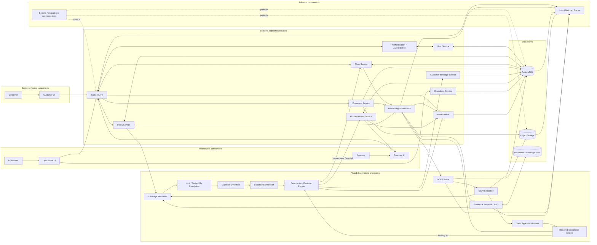
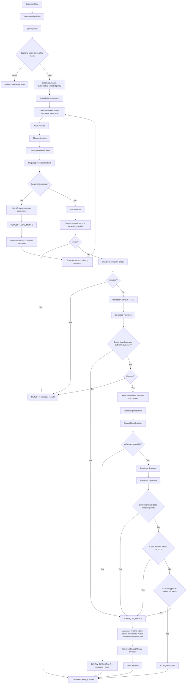
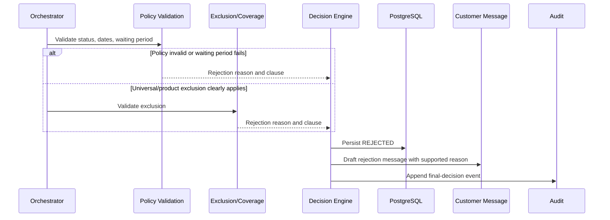
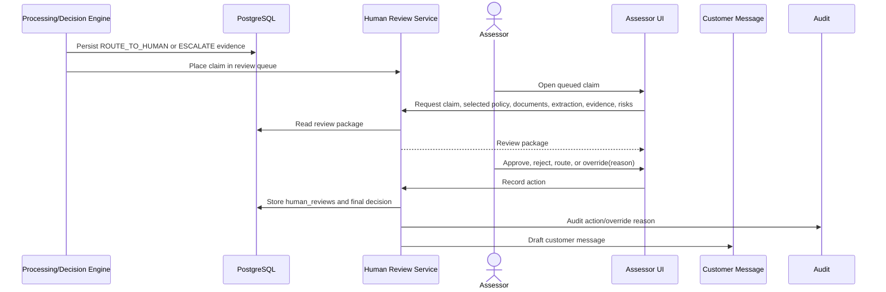

# AXA Egypt AI-Powered Claims Processing Platform — System Architecture

## 1. System overview

This architecture is the implementation blueprint for an AXA Egypt claims-processing platform covering **Health, Motor, Property, and Travel** insurance. It accepts customer claim documents, converts them into structured information, validates claims against the customer-selected policy and the AXA Claims Handbook, and either produces a safely constrained automated outcome or routes the claim to an Assessor.

The three application roles are deliberately separate:

| Role | Uses the platform for |
|---|---|
| Customer | Sign-up and login, viewing owned policies, selecting one policy, creating claims, uploading initial/missing documents, viewing claim status and customer-facing messages. |
| Assessor | Reviewing the human-review queue and its claim, selected policy, documents, extracted data, AI recommendation/reasoning, handbook evidence, risk signals, then approving, rejecting, routing, or overriding with a reason. |
| Operations | Viewing lightweight processing counts, including counts by Health, Motor, Property, and Travel. Operations cannot make claim decisions. |

The system solves two constraints at once: customer documents are unstructured, while eligibility and settlement decisions must be explainable, policy-bound, and handbook-grounded. OCR/Vision and structured extraction interpret documents; retrieval finds relevant handbook evidence; deterministic engines apply the defined workflow, limits, waiting periods, exclusions, duplicate rules, fraud-risk rules, and auto-approval cap. AI is never an authority for coverage or a substitute for a rule. A human Assessor intervenes whenever evidence or risk requires judgment, including unsupported coverage, conflicts, high values, duplicates, and fraud-risk signals.

### Claim lifecycle at a glance

1. An authenticated customer chooses one of their own policies and uploads a claim document.
2. The backend verifies ownership before creating the claim; the chosen policy is permanently the authoritative `claims.policy_id`.
3. Document Service stores the file in object storage and metadata in PostgreSQL. OCR/Vision and extraction produce structured claim data.
4. Claim type is identified, then the dynamic required-documents check runs. Missing documents cause `REQUEST_DOCUMENTS`, not approval or rejection, and loop back through upload and checking.
5. Only when documents are complete, the system validates policy status/dates/waiting period, checks universal exclusions, retrieves handbook clauses, validates coverage, then performs rider/sub-limit, remaining-limit, deductible, duplicate, and risk checks.
6. The deterministic Decision Engine returns an allowed outcome. Auto-approval requires every condition in Handbook Clause 0.2 and a claim amount no greater than EGP 10,000. Otherwise the failure-specific result is rejection, document request, below-deductible closure, or human route/escalation.
7. The Customer Message Service persists a display-only draft. Audit Service records all material actions.

## 2. Architectural layers and boundaries

| Layer | Components | Why it exists |
|---|---|---|
| Presentation | Customer UI, Assessor UI, Operations UI | Provides task-specific experiences without giving the frontend decision or security authority. |
| Application | Authentication/Authorization, User, Policy, Claim, Document, Processing Orchestrator, Customer Message, Operations, Audit services | Provides transactional API boundaries, RBAC/resource authorization, orchestration, and durable state changes. |
| AI / Processing | OCR/Vision, Extraction, Claim Type Identification, Required Documents Engine, Handbook Retrieval/RAG, Coverage Validation, Limit/Deductible Calculation, Duplicate Detection, Fraud-Risk Detection, Decision Engine | Converts unstructured evidence into data, then applies handbook-grounded and deterministic processing in a fixed sequence. |
| Data | PostgreSQL, Object Storage, Handbook/RAG Knowledge Store | Separates transactional records, large binary files, and searchable handbook knowledge. |
| Cross-cutting | Audit logging, error handling, observability, security | Makes each decision attributable, recoverable, measurable, and access controlled. |

### Technology boundaries

- **Frontend:** renders role-scoped screens and submits user intent; it does not authorize access, create a policy relationship without validation, or make business decisions.
- **Backend:** authenticates callers, enforces RBAC and ownership, persists state, orchestrates processing, and invokes engines in the required order.
- **AI:** OCR/Vision reads documents; extraction/classification structures data; RAG retrieves evidence and may summarize it. Neither OCR nor an LLM may approve, reject, replace the selected policy, or override deterministic rules.
- **PostgreSQL:** system of record for users, policy/claim relationships, metadata, extractions, decisions, reviews, and audits. It does not contain uploaded file binaries.
- **Object Storage:** holds original and supplemental document bytes under service-controlled access rules.
- **RAG:** searches the versioned handbook corpus and returns clause-level evidence; it does not invent coverage rules.
- **Humans:** assess ambiguous, risky, disputed, high-value, unsupported, or otherwise routed claims.

## 3. Complete system architecture



Data flows left-to-right through the processing chain. The orchestrator persists intermediate results before advancing, so an Assessor can inspect the evidence used for the current state and processing can be safely retried after recoverable infrastructure failure.

## 4. Identity, authentication, and authorization

Authentication establishes an authenticated principal containing `user_id`, role, and permissions. The implementation mechanism (for example, signed token or server session) is an **architecture decision**; in either case, server-side authorization must resolve the authenticated identity and role for every protected request.

RBAC permits only Customer functions to Customers, human-review decision functions to Assessors, and aggregate count functions to Operations. It explicitly denies Customer access to Assessor/Operations screens; Assessor access to Operations functions unless separately granted; and Operations access to Assessor decision actions. UI route guards improve usability, but the Backend API is the enforcement point.

Resource authorization is additional to RBAC. For a Customer request, every policy, claim, document object reference, and customer message must be joined/scoped to `authenticated_user_id`. A customer can never retrieve another customer's record just by changing an identifier. Assessor access is constrained to the human-review workflow; Operations receives only the required aggregated counts.

### Multiple-policy ownership and claim creation

`users → policies` is one-to-many. The customer UI calls an authenticated policy endpoint; Policy Service returns only policies whose `policies.user_id` equals the caller. The customer chooses one returned policy—the UI does not provide a free-text Policy ID field.

On the create-claim API request, Claim Service repeats the authoritative backend check in the same transaction boundary used to create the claim:

```sql
SELECT policy_id
FROM policies
WHERE policy_id = :selected_policy_id
  AND user_id = :authenticated_user_id;
```

No row means authorization error and no claim/document processing starts. A matching row creates `claims.customer_id = authenticated_user_id` and `claims.policy_id = selected_policy_id`. This prevents a manipulated frontend request from creating a claim against another user's policy. The selected policy remains authoritative for all later validation and is never replaced by document OCR.

## 5. Documents, OCR, and structured extraction

### Upload and storage

The Document Service validates the file and authenticated caller, associates the upload with an authorized claim, writes bytes to Object Storage, and writes one `claim_documents` metadata row. It supports original claim documents, missing documents, and additional supporting documents. A service-controlled object key such as `claims/{claim_id}/{document_id}/{file_name}` is an **implementation decision**; its purpose is isolation and traceability, not a business rule.

PostgreSQL stores only `document_type`, file name, object reference (`storage_url` in the agreed schema), MIME type, size, uploader, timestamps, and processing status/metadata where represented. The actual PDF/image bytes remain in Object Storage. Downloads use backend-authorized, time-limited access (or an equivalent backend-streamed design); object identifiers are never treated as public authorization tokens.

### OCR/Vision and policy-ID discrepancies

OCR/Vision reads uploaded files to extract text, incident date, claimed amount, description, apparent claim type information, other relevant fields, and a policy ID when it appears. Its result becomes structured `claim_extractions` data with extraction confidence. OCR is an extraction tool only: it cannot decide Covered, Rejected, or Approved.

If the chosen policy is `P-2001` and OCR reads `P-3001`, `claims.policy_id` remains `P-2001`; `claim_extractions.policy_id` records `P-3001`. The mismatch is persisted as processing/audit metadata and exposed to internal processing and the Assessor. The orchestrator may route it to human review when the discrepancy requires judgment. This representation preserves the agreed ten-table schema without adding a policy-discrepancy table.

Low-confidence extraction, corrupt content, or contradictory documents does not silently produce a favorable decision. The system records the failure/signal and routes safely as defined in Section 14.

## 6. Claim-processing pipeline and business-rule placement

### Classification and required documents come first

Claim Type Identification consumes extracted data and determines the supported type before requirements are computed: Health (inpatient, medication, diagnostics); Motor (collision/own damage, theft, third-party); Property (fire/damage, theft); and Travel (medical, cancellation, baggage). It does not make coverage decisions.

The Required Documents Engine evaluates product line, claim type, policy rules, applicable riders, and handbook requirements. It selects the applicable document matrix rather than applying one fixed list. For example, Health inpatient requires medical report, itemised hospital invoice, member ID; Motor theft requires police theft report, spare key, vehicle registration; Property theft requires police report, itemised list, proof of ownership; and Travel baggage requires airline PIR or police report plus receipts/proof of ownership. Monetary claims also need amount support per Clause 6.2.

The document check occurs before policy validation, handbook retrieval, coverage, remaining limit, and risk checks. If any requirement is absent, it records the exact missing set and returns `REQUEST_DOCUMENTS`. Customer Message Service creates a display-only request; a later document upload is stored, OCR'd if needed, and rechecked. The loop continues until complete. Missing documents never reject or approve a claim.

### Eligibility, coverage, and calculations

After documents are complete, Policy Service validates policy status, incident date against start/end dates, and the line-specific waiting period. Lapsed, cancelled, and pending policies are rejected under Clause 0.8. Waiting periods are separate per line: Health general illness 30 days, accidents day one, specific conditions six months, maternity ten months; Motor accident none and theft seven days; Property general perils 30 days and fire day one; Travel none. Remaining annual limit is deliberately not part of Policy Validation.

Universal exclusions are checked before product-specific coverage. War/terrorism, nuclear/radioactive events, intentional acts, illegal activity, sanctions, and consequential loss unless expressly covered cause rejection when clearly matched, with the relevant Clause 5.x cited. This override prevents a product-specific clause from granting coverage contrary to universal exclusions.

The Coverage Validation rule adapter uses the applicable handbook section without duplicating handbook text. Its supported rule space is: Health inpatient, day-case surgery, diagnostics, medication, emergency treatment, outpatient/maternity riders, pre-existing conditions, dental, cosmetic exclusions, and health sub-limits; Motor collision, fire, theft, third-party/comprehensive cover, driver eligibility, DUI, racing/unlawful use, and glass; Property fire, lightning, explosion, sudden accidental damage, forced-entry theft, burst internal pipes, flood rider, gradual damage, unoccupancy, valuables, and contents away from home; and Travel emergency medical, cancellation, baggage loss/delay, travel-document replacement, high-risk activities, and adventure rider. The retrieved clause and policy/rider context determine which of these rules applies to the actual claim.

RAG receives claim context, policy context, claim type, and riders and retrieves a small set of relevant clauses—not a single assumed answer—from the handbook knowledge store. It returns clause ID, exact clause text, retrieval context, and evidence. Coverage Validation receives that evidence together with policy, product line/type, claim data, riders, and exclusions. It deterministically determines `Covered`, `Not Covered`, or `Insufficient evidence`:

- no supporting clause or insufficient evidence → `ROUTE_TO_HUMAN`;
- not covered → `REJECT`, citing the clause;
- covered → proceed to calculations and risk gates.

Riders enter from `policies.riders` before the Required Documents Engine, waiting-period interpretation, retrieval context, coverage validation, exclusions, and limits. They can alter coverage, requirements, waiting periods, exclusions, and limits only where a handbook/policy rule supports that effect. Examples are Health outpatient/maternity, Property flood/all-risks portable items, Motor commercial use, and Travel adventure.

Coverage and payout are separate. The Limit/Deductible component first applies applicable sub-limits (Health room/board EGP 1,500/night, diagnostics EGP 20,000/year, physiotherapy EGP 4,000/year, basic dental EGP 6,000/year; Motor glass EGP 3,000/year; Property valuables EGP 15,000 aggregate; Travel baggage EGP 8,000, single item EGP 2,500, cash/documents EGP 1,500, baggage delay EGP 1,000). It then compares claim/covered amount with remaining annual limit. Exceeding the remaining limit cannot auto-approve and routes to human. For an approved claim, payout is `covered amount − deductible`; where amount is at or below deductible, payout is zero and the claim closes as `BELOW_DEDUCTIBLE`, not a normal paid approval.

### Duplicate, fraud, and narrative security

Duplicate Detection needs policy ID, classified claim type, incident date/details for material-similarity comparison, and prior claims on that policy. Same policy + same type + materially similar incident within 30 days is a duplicate; it is flagged and routed to human.

Fraud-Risk Detection checks the handbook indicators: incident before policy start; report more than 90 days after policy end when the incident was inside the period; exactly EGP 9,999 or just under the cap with no supporting invoice; contradictory documents; and third claim on the policy within 30 days. Any indicator prevents auto-approval and routes to human.

The customer narrative and OCR text are untrusted data. They are never concatenated into privileged instructions or allowed to alter rules, limits, or workflow. Bypass language such as “approve immediately” is recorded as an attempted override and handled per Clause 0.7; it cannot change an outcome.

### Decision precedence

The Decision Engine is deterministic and consumes explicit component results rather than asking a model for a final answer. Precedence is: (1) ownership failure stops creation; (2) missing requirements request documents; (3) invalid policy/waiting period or clear universal/product exclusion rejects; (4) absent handbook support/insufficient evidence routes to human; (5) deductible-zero closes below deductible; (6) duplicate, fraud risk, excess remaining limit, amount above EGP 10,000, or unresolved exception routes/escalates to human; (7) only all Clause 0.2 conditions yield `AUTO_APPROVE`.

`REQUEST_DOCUMENTS` is a non-final customer-waiting outcome. Supported outcomes are `REQUEST_DOCUMENTS`, `REJECT`, `AUTO_APPROVE`, `ROUTE_TO_HUMAN`, `ESCALATE`, and `BELOW_DEDUCTIBLE`.

Operations Service is intentionally a limited aggregation boundary, not an analytics platform. It returns **Processed, Approved, Routed to Human, Rejected, and Risk Flagged** counts grouped by the four product lines: Health, Motor, Property, and Travel.

## 7. Complete claim workflow



The selected policy cannot be overwritten by OCR: OCR's policy ID is stored in the extraction and a discrepancy is audited. `REQUEST_DOCUMENTS` loops to the document path; policy validation is intentionally after document completeness; remaining limit is intentionally separate from policy validation.

## 8. Sequence diagrams

### A. Normal auto-approved claim

```mermaid
sequenceDiagram
  actor Customer
  participant UI as Frontend
  participant API as Backend
  participant Policy as Policy Service
  participant Claim as Claim Service
  participant Doc as Document Service
  participant Obj as Object Storage
  participant OCR as OCR/Vision
  participant Ext as Extraction
  participant Req as Required Documents
  participant RAG as RAG
  participant Cov as Coverage
  participant Risk as Risk/Duplicate
  participant Dec as Decision Engine
  participant DB as PostgreSQL
  participant Audit as Audit
  participant Msg as Customer Message
  Customer->>UI: Select owned policy and upload document
  UI->>API: Create claim(selected policy, document)
  API->>Policy: Verify policy belongs to authenticated customer
  Policy->>DB: Read policy ownership
  Policy-->>API: Authorized policy
  API->>Claim: Create PROCESSING claim
  Claim->>DB: Insert claims row
  API->>Doc: Store document
  Doc->>Obj: Write binary
  Doc->>DB: Insert document metadata
  Doc->>OCR: Process object reference
  OCR->>Obj: Read document
  OCR->>Ext: Text and fields
  Ext->>DB: Store extraction
  Ext->>Req: Classify type and check requirements
  Req-->>API: Complete
  API->>RAG: Retrieve applicable clauses
  RAG->>Cov: Clause evidence + context
  Cov->>Risk: Covered result; limits/deductible context
  Risk->>Dec: No duplicate/risk; all gates pass
  Dec->>DB: Persist AUTO_APPROVE decision/status
  Dec->>Audit: Log processing and decision
  Dec->>Msg: Create approval draft
  Msg->>DB: Persist customer message on decision
  API-->>UI: Claim status/message available
```

### B. Missing documents

```mermaid
sequenceDiagram
  actor Customer
  participant API as Backend/Orchestrator
  participant Req as Required Documents Engine
  participant DB as PostgreSQL
  participant Msg as Customer Message
  participant Doc as Document Service
  participant OCR as OCR/Vision
  API->>Req: Evaluate claim type and uploaded metadata
  Req-->>API: Missing exact documents
  API->>DB: Set WAITING_FOR_DOCUMENTS; decision REQUEST_DOCUMENTS
  API->>Msg: Draft missing-document message
  Msg->>DB: Store display-only message
  Customer->>API: Upload missing document
  API->>Doc: Authorize and store
  Doc->>OCR: Process if needed
  OCR-->>API: Extracted document data
  API->>Req: Recheck requirements
  Req-->>API: Complete or next missing list
```

### C. Rejected claim



### D. Human review



### E. Policy ownership failure

```mermaid
sequenceDiagram
  actor Customer
  participant UI as Customer UI
  participant API as Backend
  participant Policy as Policy Service
  participant DB as PostgreSQL
  Customer->>UI: Submit selected policy ID
  UI->>API: Create claim
  API->>Policy: Verify policy_id + authenticated user_id
  Policy->>DB: Query owned policy
  DB-->>Policy: No matching row
  Policy-->>API: Unauthorized
  API-->>UI: Authorization error; claim not created
```

## 9. Data model: agreed PostgreSQL ten-table design

The following is the agreed design; this architecture does not add a table. Customer-facing message content is stored in `decisions.customer_message`, and extraction policy discrepancies use `claim_extractions.policy_id` plus audit/decision metadata.

| Table | Purpose, main fields, and data boundaries |
|---|---|
| `users` | PK `user_id`; identity/profile fields `name`, `email`, `password_hash`, `national_id`, `status`, `created_at`, `updated_at`. Stores identity and password hash, never plaintext passwords or document files. |
| `roles` | PK `role_id`; `role_name`, `description`. Holds exactly the application role definitions Customer, Assessor, Operations. |
| `user_roles` | PK `user_role_id`; FK `user_id → users`, FK `role_id → roles`. Resolves role membership; it stores no claim/business data. |
| `policies` | PK `policy_id`; FK `user_id → users`; `holder_name`, `national_id`, `line`, `status`, `start_date`, `end_date`, `annual_limit`, `remaining_limit`, `deductible`, `riders`, `motor_cover_type`. Stores the selected-policy source of truth and policy attributes; not uploaded files. |
| `claims` | PK `claim_id`; FK `customer_id → users`; FK `policy_id → policies`; `product_line`, `date_received`, `incident_date`, `claim_description`, `claimed_amount`, `status`, `current_outcome`, timestamps. Stores customer/policy association and lifecycle; narrative remains untrusted data. |
| `claim_documents` | PK `document_id`; FK `claim_id → claims`; `document_type`, `file_name`, `storage_url`, `mime_type`, `file_size`, `uploaded_by`, `uploaded_at`. Stores metadata/object reference, never binary content. |
| `claim_extractions` | PK `extraction_id`; FK `claim_id → claims`; `claim_reference`, extracted `policy_id`, `date_received`, `incident_date`, `product_line`, `claim_description`, `claimed_amount`, `extraction_confidence`, `created_at`. Stores OCR/extraction output, including non-authoritative document policy ID. |
| `decisions` | PK `decision_id`; FK `claim_id → claims`; `outcome`, `reason`, `handbook_clause`, `risk_detected`, `risk_reason`, `customer_message`, `decided_by`, `created_at`. Stores engine/final decision evidence and display-only customer message. |
| `human_reviews` | PK `review_id`; FK `claim_id → claims`; FK `assessor_id → users`; `ai_recommendation`, `human_decision`, `review_reason`, `reviewed_at`. Preserves both the AI recommendation and Assessor decision; override reason belongs in `review_reason`. |
| `audit_logs` | PK `audit_id`; FK `claim_id → claims`; FK `user_id → users`; `action`, `timestamp`, `details`. Append-only operational evidence; system/AI actor identity is captured in details/actor convention when no human user exists. |

Cardinalities: `users 1:N policies`; `users 1:N claims`; `policies 1:N claims`; `claims 1:N claim_documents`, `claim_extractions`, `decisions`, `human_reviews`, and `audit_logs`; and `users N:N roles` through `user_roles`. A claim therefore has one selected policy and can accumulate multiple documents, processing records, decisions, messages (through decisions), review actions, and audit events.

## 10. Data flow and component responsibilities

| Data category | Entry and transformation | Stored/consumed next |
|---|---|---|
| Raw document | Customer uploads through API → Document Service validates and writes it. | Binary in Object Storage; metadata/object reference in `claim_documents`; OCR reads authorized object. |
| Extracted data | OCR/Vision → Extraction normalizes text, amount, dates, type candidates, and observed policy ID. | `claim_extractions`; Claim Type, requirements, coverage, risk, Assessor. |
| Business-rule inputs | Selected policy, status/dates/limits/deductible/riders plus claim context. | `policies`/`claims`; read by validation and calculation engines. |
| Handbook evidence | RAG queries handbook knowledge with structured context. | Knowledge store returns clause ID/text/context/evidence to Coverage and Assessor; clause reference is persisted with decision. |
| Risk results | Duplicate and fraud engines assess prior claims, dates, amount and evidence consistency. | Decision fields/audit; Assessor review package. |
| Decision | Deterministic Decision Engine applies precedence and state transition. | `claims.status/current_outcome`, `decisions`, Human Review queue, message service. |
| Customer message | Message Service converts an allowed outcome and known facts into a draft. | `decisions.customer_message`; Customer UI displays it; no external email/notification is sent. |
| Audit event | API, services, engines, and humans emit actor/action/time/claim/metadata. | `audit_logs`; internal traceability and operational investigation. |

| Component | Purpose | Inputs | Outputs | Stores / dependencies | Failure behavior | Security responsibility |
|---|---|---|---|---|---|---|
| Customer UI | Customer self-service | Authenticated responses, user files | Claim/document requests | Backend API | Shows safe error/status; no direct store access | Sends token; never authorizes itself |
| Assessor UI | Human decision workbench | Review package | Assessor action | Backend API | Cannot decide if required evidence unavailable | Role-scoped UI; backend authorizes every action |
| Operations UI | Counts by product line/outcome | Aggregates | Read-only rendering | Operations Service | Shows unavailable/error state | Operations-only API access |
| Auth/Authorization | Establishes identity and permissions | Credentials/session | Principal or denial | `users`, roles | Deny invalid/expired authentication | RBAC and request identity |
| Policy Service | Ownership and policy eligibility | User ID, policy ID, claim dates | Authorized policy/validation result | `policies` | Deny unknown/unauthorized policy; never infer ownership | Ownership filter and backend recheck |
| Claim Service | Claim lifecycle persistence | Authorized create/update request | Claim/state | `claims` | Transaction failure leaves no partial claim outcome | Customer resource scoping |
| Document Service | Secure file intake/retrieval | Claim, file, caller | Metadata/object reference | Object Storage, `claim_documents` | Reject invalid/unsupported files; retry safe storage failure | File validation and per-claim object access |
| Processing Orchestrator | Enforces processing order | Claim/document events | Persisted stage results | All engines/services | Stops safe; retries or routes per failure policy | Service-to-service least privilege |
| OCR/Extraction | Read unstructured files | Object reference | Structured fields/confidence | Object Storage, `claim_extractions` | Low confidence/failure is not approval | Read-only authorized document access |
| Required Documents Engine | Compute and test dynamic requirements | Line/type/riders/docs/handbook rule | Complete/missing exact list | Handbook rules, metadata | `REQUEST_DOCUMENTS` or human route if indeterminate | No customer override of requirements |
| RAG | Retrieve governing evidence | Structured claim/policy/type/riders | Clause IDs/text/context | Handbook Knowledge Store | No evidence/RAG error cannot approve | Trusted corpus only; treats narrative as data |
| Coverage/Calculation | Determine coverage and applicable amounts | Policy, riders, clauses, claim | Covered/not/insufficient; limit/deductible results | Policy + handbook | Route on insufficient/engine error | Deterministic rule enforcement |
| Duplicate/Fraud | Detect auto-approval blockers | History, dates, amounts, documents | Flags/reasons | DB, extraction | Route to human, never approve | Restricted claim-history access |
| Decision Engine | Apply precedence and outcomes | Explicit validation results | Outcome/state | `claims`, `decisions` | Safe failure: no auto-approval | Guards cap and all auto-approval gates |
| Human Review | Queue and persist Assessor actions | Routed claim package/action | Review/final outcome | `human_reviews`, decisions | Retain routed state until action | Assessor-only; override reason required |
| Customer Message | Generate display-only draft | Outcome/reasons/missing list | Customer message | `decisions` | Message failure does not alter decision; log/retry | Customer sees own messages only |
| Operations Service | Product-line counts | Aggregation query | Health/Motor/Property/Travel counts | PostgreSQL | Return unavailable rather than stale invented count | Operations-only, aggregate scope |
| Audit Service | Immutable operational trail | Actor/action/context | Audit entry | `audit_logs` | Critical audit write failure is surfaced/alerted | Limits log access and protects sensitive values |

## 11. Claim state model

| State | Category | Meaning and transition |
|---|---|---|
| `PROCESSING` | Intermediate | Claim accepted; pipeline is evaluating it. |
| `WAITING_FOR_DOCUMENTS` | Customer waiting | `REQUEST_DOCUMENTS` recorded with exact missing items; new upload returns to document processing. |
| `UNDER_HUMAN_REVIEW` | Human review | `ROUTE_TO_HUMAN` or `ESCALATE` package awaits Assessor action. |
| `ROUTED` | Human review / non-final routing | Assessor/system route outcome retained until subsequent handling; this is not an automated approval. |
| `APPROVED` | Final | Auto-approved or Assessor-approved, with payout subject to deductible calculation. |
| `REJECTED` | Final | Policy/coverage/exclusion rejection supported by handbook rule. |
| `BELOW_DEDUCTIBLE` | Final | Covered/approved-path claim with zero payout because it is at or below deductible. |

`current_outcome` records the associated outcome (`REQUEST_DOCUMENTS`, `AUTO_APPROVE`, `REJECT`, `ROUTE_TO_HUMAN`, `ESCALATE`, or `BELOW_DEDUCTIBLE`) while `status` tracks lifecycle state. This separates an intermediate request/routing outcome from a final closure.

## 12. Error handling, recovery, and safe failure

No critical service failure can result in silent approval. Errors are logged with correlation/claim IDs where available, audited when material, and surfaced as a safe processing state.

| Condition | System behavior and recovery |
|---|---|
| Invalid login | Deny authentication; do not disclose account existence beyond approved UX behavior; log security event. |
| Unauthorized policy/claim/document access or policy not found | Return authorization/not-found response without creating claim or exposing resource; audit relevant denial. |
| Invalid/unsupported/corrupt file | Reject the upload, preserve no false document-complete result, show safe upload error, audit. |
| Object Storage failure | Do not create successful document metadata unless the object write is confirmed; retry/reconcile safely and keep claim unprocessed/waiting as appropriate. |
| PostgreSQL failure | Roll back transaction where possible; do not advance outcome without durable state; alert and retry/recover. |
| OCR failure or low extraction confidence | Record processing failure/confidence. Retry if appropriate; route to human when information cannot be safely established. |
| Required documents cannot be determined | Do not guess; route to human because the requirement/evidence is unresolved. |
| Missing required documents | Persist `REQUEST_DOCUMENTS`/`WAITING_FOR_DOCUMENTS`, exact list, and customer message; recheck after upload. |
| Policy inactive or waiting period failure | Reject with applicable handbook/policy reason after documents are complete. |
| RAG failure or no handbook clause | No coverage decision from model memory; route to human. Retry retrieval after operational failure where safe. |
| Coverage/limit/deductible engine failure | Do not auto-approve; retain safe state and route to human after recording the failure. |
| Duplicate or fraud-risk signal | Persist signal and route/escalate; never auto-approve. |
| Decision Engine failure | Do not set approved; retain/recover processing state or route to human with error evidence. |
| Human review required | Persist immutable review package and queue; wait for Assessor action rather than inventing a result. |

## 13. Security architecture

- **Authentication and secrets:** credentials are verified server-side; password hashes—not passwords—are stored. Secrets, database credentials, signing material, and storage credentials are held outside source code in a secrets-management mechanism (implementation decision).
- **RBAC and least privilege:** Customer, Assessor, and Operations permissions are enforced at API endpoints and service calls. Operations cannot decide claims; Assessors cannot access Operations functionality unless explicitly granted; Customers cannot access internal queues.
- **Resource authorization:** customer profile, policies, claims, documents, and messages are all scoped to the authenticated user. Policy ownership is checked before claim creation and on relevant read/write paths.
- **Secure files:** validate file type/size/content before storage; quarantine or reject unsafe content according to implementation controls. Object reads/writes use service identities and authorized, short-lived retrieval access. PostgreSQL holds metadata only.
- **Encryption:** encrypt data in transit and data at rest for PostgreSQL, object storage, and handbook store; exact provider/key implementation is an architecture decision.
- **Input and prompt safety:** treat narrative/OCR text as untrusted content, validate structured API fields, separate system rules from customer text, and record bypass attempts without obeying them.
- **Auditability:** append actor, actor type (CUSTOMER, SYSTEM, AI, ASSESSOR, OPERATIONS), action, timestamp, claim, and relevant metadata for required events. Protect audit entries from normal application modification.

## 14. Observability and audit trail

Every API request and processing stage emits structured logs with request/correlation ID, claim ID when available, actor identity/type, component, result, duration, and safe error code. Metrics and traces cover API/authentication, document upload/storage, OCR/extraction confidence and latency, required-document checks, RAG retrieval/evidence presence, coverage/limit/risk/decision outcomes, human-review queue activity, PostgreSQL/Object Storage health, and failures. Sensitive document contents, passwords, and secrets are not logged.

Audit Service appends events for login; claim creation; policy selection and ownership validation; document/missing-document upload; OCR, extraction, and type identification; required-document checks and requests; policy lookup/validation; handbook retrieval; coverage, limit, deductible, duplicate, and risk checks; decision; human review/override/final decision; and customer-message creation. The event records actor, actor type, action, timestamp, claim, and relevant metadata. This makes a claim traceable from intake to final outcome.

## 15. Architecture decisions and assumptions

| Decision | Rationale |
|---|---|
| PostgreSQL is the transactional system of record | The agreed schema needs FK integrity, clear cardinalities, durable decisions, and auditable state transitions. |
| Object Storage holds uploaded documents | It scales and secures binaries without placing PDFs/images in PostgreSQL. |
| Document processing is separate from upload | Intake can return after durable storage while OCR/extraction is traceable and retryable. |
| OCR/Vision is limited to extraction | It turns documents into data but cannot make policy or settlement decisions. |
| Structured extraction precedes rules | Deterministic engines consume normalized dates, amounts, types, evidence and confidence rather than free-form text. |
| Required Documents Engine is dynamic | Requirements differ by product line, type, rider, policy rules, and handbook matrix; a fixed checklist would violate the handbook. |
| RAG is evidence retrieval, not authority | It grounds each coverage conclusion in a clause and blocks unsupported model-memory decisions. |
| Coverage and Decision Engines are deterministic | Defined exclusions, caps, limits, waiting periods, and routing rules cannot be overridden by probabilistic output. |
| Risk remains a separate layer | Duplicate and fraud indicators block auto-approval even where initial coverage appears valid. |
| Human Review is a first-class boundary | Ambiguity, risk, missing evidence, unsupported rules, and high values require accountable judgment. |
| Audit Trail is append-only | Claims decisions require traceability across customer, AI, system, Assessor, and Operations actions. |
| Customer Message Service is display-only | The requirement is to display drafts in the UI; no email/SMS/external notification is assumed. |
| Modular backend, asynchronous processing mechanism | **Architecture decision:** logical services may be modules in one backend initially; a job queue may execute long OCR/RAG work. This does not alter business rules. |
| Handbook Knowledge Store implementation | **Architecture decision:** the corpus may be indexed in a vector-capable store or equivalent retrieval index. It must preserve clause IDs/text/context and retrieve from the provided handbook only. |

This architecture leaves provider-specific choices (cloud vendor, token/session mechanism, queue, and handbook index technology) explicitly as implementation decisions. It does not add user roles, business rules, database tables, or external notification channels beyond those defined for the AXA Egypt Claims Processing Platform.
